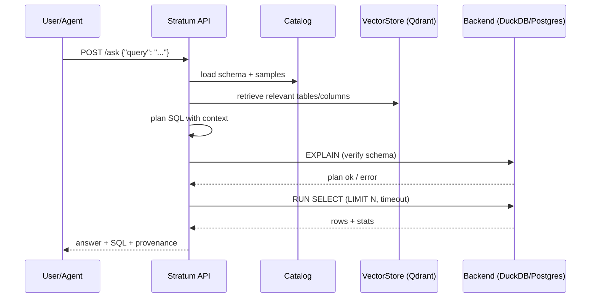

# Architecture (MVP)

## Components
- **Catalog Crawler & Profiler**: enumerate tables/columns, sample values, stats
- **Explainer & Indexer**: NL descriptions + embeddings → VectorStore
- **Retriever**: hybrid (keyword + vector) returns relevant tables/columns
- **Planner**: NL→SQL using schema context
- **Verifier**: EXPLAIN/dry-run, safe guards (SELECT-only, LIMIT)
- **Executor**: run plan on DuckDB/Postgres; return Arrow/Parquet-friendly frames
- **API Layer**: FastAPI exposing `/describe`, `/find`, `/ask`

## Sequence (MVP)

