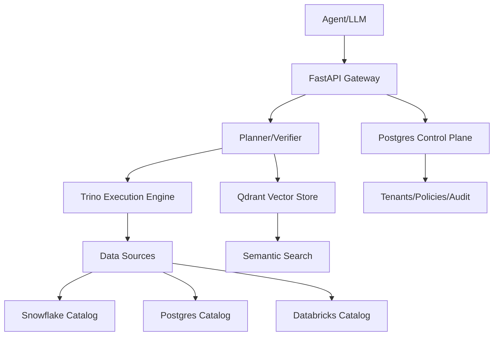
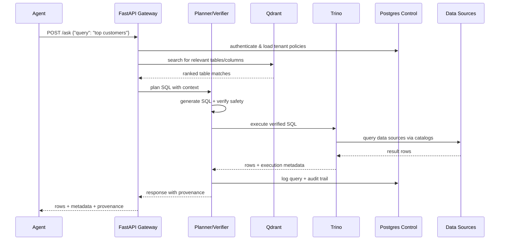

# Architecture

## High-Level Design

## Core Components

### API Gateway (FastAPI)
- **Request Handling**: `/describe`, `/find`, `/ask` endpoints
- **Authentication**: API key validation, tenant resolution
- **Rate Limiting**: Per-tenant query limits and throttling
- **Response Formatting**: Consistent metadata and error handling

### Planner & Verifier
- **Context Assembly**: Inject relevant schema from semantic search
- **SQL Generation**: LLM-powered NL→SQL with catalog-aware prompts
- **Safety Verification**: SQLGlot parsing, read-only enforcement, schema validation
- **Query Routing**: Determine appropriate Trino catalog for execution

### Execution Engine (Trino)
- **Universal Query Engine**: Single interface for 20+ data source types
- **Catalog Management**: Snowflake, Postgres, Databricks, etc. as Trino catalogs
- **Query Execution**: Distributed SQL processing with result streaming
- **Performance**: Columnar processing, predicate pushdown, parallel execution

### Semantic Retrieval (Qdrant)
- **Schema Indexing**: Table/column metadata with NL descriptions as vectors
- **Hybrid Search**: Combine keyword matching with semantic similarity
- **Context Ranking**: Return most relevant tables/columns for query planning
- **Metadata Filtering**: Restrict search by catalog, schema, or permissions

### Unstructured Retrieval (Documents)
- **Document Index**: Passages stored with doc/source metadata
- **Hybrid Ranking**: semantic + keyword; diversity by document
- **Policy-aware**: filter by ACLs/labels; redaction before return

### Control Plane (Postgres)
- **Tenant Management**: Organizations, users, API keys, permissions
- **Catalog Configuration**: Data source connections, schema sync settings
- **Policy Storage**: Row/column access rules, rate limits, blocked schemas
- **Audit Trail**: Query logs, execution stats, policy violations

## Request Flow

## Data Flow

### Schema Discovery
1. **Catalog Sync**: Periodic jobs crawl Trino catalogs for new tables/columns
2. **Metadata Enhancement**: Generate NL descriptions via LLM for new schemas
3. **Vector Indexing**: Embed table/column descriptions into Qdrant
4. **Control Plane Update**: Store catalog metadata in Postgres for policy enforcement

### Query Processing
1. **Authentication**: Validate API key and resolve tenant context
2. **Semantic Search**: Find relevant tables using hybrid keyword+vector search
3. **SQL Planning**: Generate SQL with schema context and tenant policies
4. **Safety Verification**: Parse SQL, enforce read-only, inject limits
5. **Execution**: Route to appropriate Trino catalog and execute
6. **Response Assembly**: Format results with provenance and execution metadata

## Deployment Architecture

### Development
- **Docker Compose**: All services (FastAPI, Trino, Qdrant, Postgres) locally
- **Sample Catalogs**: CSV files and sample Postgres for testing
- **Hot Reload**: FastAPI with uvicorn --reload for rapid iteration

### Production 
- **Kubernetes**: Helm charts for multi-service deployment
- **Managed Services**: Cloud Postgres, optionally managed Trino/Qdrant
- **Load Balancing**: Multiple FastAPI replicas behind ingress
- **Observability**: Prometheus metrics, structured logging, distributed tracing
