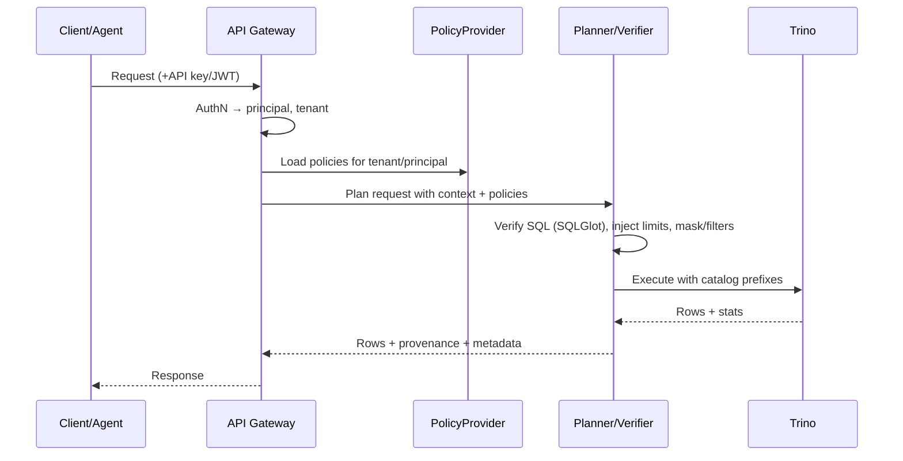

# Security Strategy

This document defines Stratum Core's security model and the pluggable interfaces used to extend it.

## Principles
- Secure by default in open source (no paywall for basic safety)
- Pluggable integrations for enterprise identity/governance
- Enforce policies in the planner/verifier before execution (Trino)
- Least-privilege: read-only credentials; explicit allowlists

## Threat Model (high level)
- Unauthorized access to APIs or data sources
- Excessive data exfiltration via large scans or unbounded queries
- Policy bypass due to missing validation or misconfiguration
- Credential leakage or insecure storage

## Core Facets

### 1) Authentication (AuthN)
- Supported in Core:
  - API keys per tenant (scoped)
  - Bearer JWT verification with shared secret (HS256) or JWKS (RS256)
- Pluggable OIDC/SAML providers (see Interfaces) for enterprise SSO

### 2) Authorization (AuthZ)
- Scopes: `describe`, `find`, `ask`, `admin:*`
- RBAC: roles map to scopes; roles assigned to principals (user/service) within a tenant
- Policy types:
  - Catalog/Schema/Table blocklists/allowlists
  - Column masking (static or predicate-based)
  - Row filters (predicate templates)
  - Rate/row/time caps per tenant/role
- Enforcement points:
  - Pre-plan: catalog/scope gating
  - Verify: SQLGlot checks → inject LIMIT; strip DML; validate objects against policies
  - Execute: Trino limits/timeouts; catalog prefixing

### 3) Identity & Tenancy
- Tenant context derived from API key or token claims (`tid`, `org_id`)
- User identity via JWT claims (`sub`, `email`, groups)
- Principal resolution: user → roles → scopes → policies

### 4) Secrets Management
- Core: Credentials encrypted at rest in Postgres using app key; rotation hooks
- Enterprise integrations: Vault / AWS Secrets Manager / Azure Key Vault (via SecretProvider)

### 5) Audit & Observability
- Core logs (structured): request id, tenant, principal, route, routed_reason, engine, query_id, timing, result size
- Audit export hooks: stdout/OTEL; Enterprise: SIEM sinks + retention policies

### 6) Network & Runtime Safety
- Trino read-only roles/users for catalogs
- API timeouts; size limits; pagination; content-length caps
- Optional IP allowlists (reverse proxy / API gateway)

## Data Flow with Enforcement

## Security Posture by Tier
- Core (OSS): full AuthN/AuthZ, policy enforcement, audit logs, basic secrets; safe by default
- Enterprise (optional): SSO/SCIM, external secrets, OPA/Ranger integration, long-term audit, admin UI

> Baseline security is not paywalled. Enterprise layers add integrations and admin UX.
